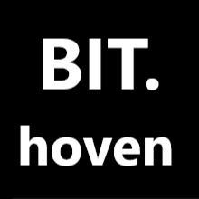

<!DOCTYPE html>
<html lang="en">
<head>
    <meta charset="UTF-8">
    <meta name="viewport" content="width=device-width, initial-scale=1.0">
    <title>BIT/hoven</title>
    
</head>
<body>
    
    

    

    

        <h2>BIT/hoven.incompareitet</h2>
        
Текст еще не придумал но Глеб зацини всеровно

        
Мой <a href="mailto:email@example.com">Mail</a>.

        
Мой <a href="https://www.instagram.com/kostyukevich.33/?next=%2F">Instagram</a>.

    

</body>
</html>
